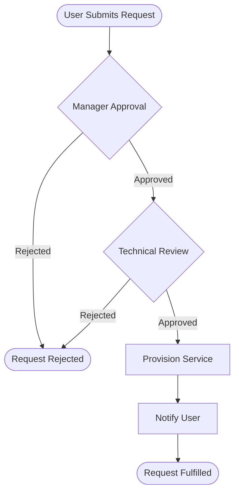
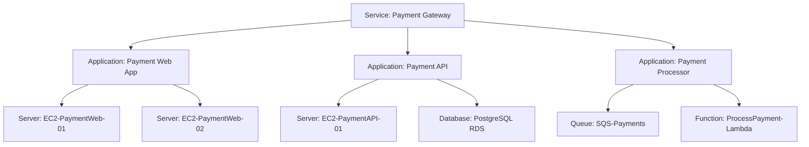

# ServiceNow Service Design

**Project**: [Project Name]
**Service Name**: [Service Name]
**Document Version**: 1.0
**Last Updated**: [Date]
**Document Owner**: [Name/Role]

---

## 1. Service Overview

### 1.1 Service Description

[Brief description of the service being designed for ServiceNow. What business capability does it provide?]

**Service Type**: [Application Service / Infrastructure Service / Business Service]

**Service Owner**: [Team/Department responsible for the service]

**Business Justification**: [Why this service exists, business value delivered]

### 1.2 Service Dependencies

**Upstream Dependencies** (services this depends on):
- [Dependency 1]: [Description of dependency]
- [Dependency 2]: [Description of dependency]

**Downstream Dependencies** (services that depend on this):
- [Consumer 1]: [How they use this service]
- [Consumer 2]: [How they use this service]

### 1.3 Service Lifecycle Stage

**Current Stage**: [Development / Testing / Private Beta / Public Beta / Live / Retiring]

**Compliance Requirements**:
- [ ] UK Government Technology Code of Practice (if applicable)
- [ ] UK Government AI Playbook (if AI system)
- [ ] ATRS published (if algorithmic transparency required)
- [ ] DPIA completed (if processing PII)
- [ ] GDS Service Standard (for public-facing services)

---

## 2. Service Catalog Entry Design

### 2.1 Service Catalog Item

**Display Name**: [User-facing name in ServiceNow catalog]

**Short Description**: [One-line description (max 100 chars)]

**Full Description**:
[Detailed description of what the service does, who it's for, and how to request it]

**Category**: [ServiceNow category hierarchy, e.g., "IT Services > Cloud Services > API Services"]

**Request Process**:
1. [Step 1: e.g., User submits request via Service Catalog]
2. [Step 2: e.g., Approval from line manager]
3. [Step 3: e.g., Technical review by service team]
4. [Step 4: e.g., Provisioning (automated/manual)]
5. [Step 5: e.g., Access credentials delivered to user]

### 2.2 Request Fulfillment Workflow



**Fulfillment Time**: [Expected time from request to delivery, e.g., "4 hours"]

**Approval Chain**:
| Approval Stage | Approver Role | Timeout | Auto-Approve Conditions |
|----------------|---------------|---------|------------------------|
| Manager Approval | Line Manager | 2 days | If user grade ≥ Senior Officer |
| Technical Review | Service Owner | 1 day | If standard configuration |
| Security Review | InfoSec Team | 3 days | N/A (always required) |

---

## 3. CMDB Design

### 3.1 Configuration Item Hierarchy

**Service CI**: [Top-level service CI name in CMDB]

**CI Relationships**: (Derived from architecture diagrams)



### 3.2 CI Inventory Table

| CI Name | CI Class | Parent CI | Owner | Environment | Attributes |
|---------|----------|-----------|-------|-------------|------------|
| [Service Name] | Business Service | - | [Team] | PROD | Tier: [1/2/3], Criticality: [High/Medium/Low] |
| [Application 1] | Application | [Service Name] | [Team] | PROD | Tech: [Stack], Version: [X.Y.Z], Repo: [GitHub URL] |
| [Application 2] | Application | [Service Name] | [Team] | PROD | Tech: [Stack], Version: [X.Y.Z], Repo: [GitHub URL] |
| [Database 1] | Database | [Application] | [Team] | PROD | Tech: [DB Type], Size: [Storage], Backup: [Schedule] |
| [Server 1] | Server | [Application] | [Team] | PROD | Instance: [Type], AZ: [Zone], IP: [Address] |

### 3.3 CI Attributes Schema

**Standard Attributes** (for all CIs):
- `name`: [Unique identifier]
- `u_service_tier`: [Tier 1 (critical) / Tier 2 (important) / Tier 3 (standard)]
- `u_compliance_tags`: [UK GDPR, PCI-DSS, ISO27001, etc.]
- `u_cost_center`: [Finance code for chargeback]
- `support_group`: [Assignment group for incidents]
- `change_control`: [Standard / Normal / Emergency allowed]

**Application-Specific Attributes**:
- `u_technology_stack`: [Programming language, framework]
- `u_repository_url`: [GitHub/GitLab URL]
- `u_api_endpoint`: [Production API base URL]
- `u_health_check_url`: [Monitoring endpoint]
- `u_runbook_url`: [Confluence/Wiki page for operations]

**Infrastructure-Specific Attributes**:
- `u_cloud_provider`: [AWS / Azure / GCP]
- `u_cloud_account_id`: [Account identifier]
- `u_region`: [e.g., eu-west-2 for UK]
- `u_availability_zone`: [e.g., eu-west-2a]
- `u_auto_scaling`: [Yes/No, min/max instances]

---

## 4. Change Management Plan

### 4.1 Change Categories

| Change Type | Description | Approval Required | Lead Time | Downtime Window |
|-------------|-------------|-------------------|-----------|-----------------|
| **Standard Change** | Pre-approved, low-risk (e.g., config updates, scaling) | None (auto-approved) | 1 hour | None (zero-downtime) |
| **Normal Change** | Moderate risk (e.g., feature releases, schema changes) | Change Advisory Board (CAB) | 5 days | Maintenance window only |
| **Emergency Change** | Critical fixes (e.g., security patches, outage resolution) | Emergency CAB (ECAB) | 2 hours | Allowed 24/7 with approval |
| **Major Change** | High-risk (e.g., architecture changes, migrations) | Senior Leadership + CAB | 14 days | Planned downtime (communicated 30 days ahead) |

### 4.2 Change Schedule

**Maintenance Windows**:
- **Standard**: [Day of week] [Time range in UTC], e.g., "Sunday 02:00-06:00 UTC"
- **Emergency**: Any time with ECAB approval

**Blackout Periods** (no changes allowed):
- [e.g., UK fiscal year-end: April 1-7]
- [e.g., Peak usage period: December 15 - January 15]
- [e.g., Public holidays: Bank holidays + 1 day before/after]

### 4.3 Change Risk Assessment

**Risk Matrix** (used for change approval):

| Impact | Probability High | Probability Medium | Probability Low |
|--------|-----------------|-------------------|-----------------|
| **Critical** (Service down) | High Risk (ECAB) | High Risk (ECAB) | Medium Risk (CAB) |
| **High** (Major degradation) | High Risk (ECAB) | Medium Risk (CAB) | Low Risk (CAB) |
| **Medium** (Minor impact) | Medium Risk (CAB) | Low Risk (CAB) | Standard Change |
| **Low** (No user impact) | Low Risk (CAB) | Standard Change | Standard Change |

### 4.4 Rollback Plan Template

**Pre-Change Checklist**:
- [ ] Backup of current configuration/data
- [ ] Rollback procedure documented and tested
- [ ] Rollback decision criteria defined (what constitutes failure)
- [ ] Rollback owner identified
- [ ] Communication plan for rollback prepared

**Rollback Decision Criteria**:
- [Criterion 1: e.g., Error rate >5% for 10 minutes]
- [Criterion 2: e.g., Response time >3s for 5 minutes]
- [Criterion 3: e.g., Any data corruption detected]

**Rollback Steps**:
1. [Step 1: e.g., Switch traffic back to previous version via load balancer]
2. [Step 2: e.g., Restore database from backup (if schema changed)]
3. [Step 3: e.g., Restart services with previous configuration]
4. [Step 4: e.g., Verify health checks pass]
5. [Step 5: e.g., Notify stakeholders of rollback]

---

## 5. Incident Management Design

### 5.1 Incident Priority Matrix

| Impact | Urgency High | Urgency Medium | Urgency Low |
|--------|--------------|----------------|-------------|
| **Critical** (All users unable to access service) | **P1** (Target: 15min response, 4hr resolution) | **P2** (Target: 1hr response, 8hr resolution) | **P3** (Target: 4hr response, 24hr resolution) |
| **High** (Major feature unavailable, >50% users affected) | **P2** (Target: 1hr response, 8hr resolution) | **P3** (Target: 4hr response, 24hr resolution) | **P4** (Target: 1 day response, 3 days resolution) |
| **Medium** (Minor feature degraded, <50% users affected) | **P3** (Target: 4hr response, 24hr resolution) | **P4** (Target: 1 day response, 3 days resolution) | **P4** (Target: 1 day response, 5 days resolution) |
| **Low** (Cosmetic issue, single user affected) | **P4** (Target: 1 day response, 3 days resolution) | **P4** (Target: 1 day response, 5 days resolution) | **P5** (Target: 2 days response, 10 days resolution) |

### 5.2 Incident Categories and Assignment Groups

| Incident Category | Subcategory | Assignment Group | Escalation Path | On-Call Required |
|-------------------|-------------|------------------|-----------------|------------------|
| [Service Name] - Authentication | Login Failure | [Team]-Auth-L2 | [Team]-Auth-L3 → Engineering Lead | Yes (P1/P2) |
| [Service Name] - API | Timeout / 5xx Errors | [Team]-Backend-L2 | [Team]-Backend-L3 → Engineering Lead | Yes (P1/P2) |
| [Service Name] - Database | Connection / Performance | DBA-Support | DBA-Senior → Infrastructure Manager | Yes (P1/P2) |
| [Service Name] - Frontend | UI Errors / Display Issues | [Team]-Frontend-L2 | [Team]-Frontend-L3 → Engineering Lead | No |
| [Service Name] - Infrastructure | Server Down / Network | Infrastructure-L2 | Infrastructure-L3 → Infrastructure Manager | Yes (P1/P2) |

### 5.3 Incident Response Runbooks

**P1 Incident Response** (Critical Outage):

1. **Detection** (0-5 min):
   - Incident detected via [monitoring system, e.g., Datadog]
   - Auto-create ServiceNow incident with P1 priority
   - Auto-page on-call engineer via [PagerDuty/Opsgenie]

2. **Initial Response** (5-15 min):
   - On-call engineer acknowledges page
   - Join incident bridge: [Conference line/Slack channel]
   - Update ServiceNow incident with initial assessment
   - Notify stakeholders via [communication channel]

3. **Diagnosis** (15-60 min):
   - Check health dashboards: [Grafana URL]
   - Review error logs: [CloudWatch/Splunk URL]
   - Identify root cause component
   - Assign incident to component owner team

4. **Mitigation** (60-240 min):
   - Implement fix OR rollback (see Change Management)
   - Monitor key metrics for recovery
   - Update incident status every 30 minutes
   - Keep stakeholders informed

5. **Resolution** (Post-fix):
   - Verify all health checks pass
   - Confirm user-reported issues resolved
   - Close incident with resolution notes
   - Schedule post-incident review (PIR) within 48 hours

**Escalation Triggers**:
- P1 not acknowledged within 5 minutes → Escalate to manager
- P1 not resolved within 4 hours → Escalate to Engineering Lead
- P1 not resolved within 8 hours → Escalate to Service Owner + CTO

### 5.4 Major Incident Management

**Major Incident Criteria** (automatically escalated to Major Incident Team):
- [Criterion 1: e.g., All UK production services down]
- [Criterion 2: e.g., Data breach or security compromise]
- [Criterion 3: e.g., Financial loss >£50k/hour]
- [Criterion 4: e.g., Regulatory compliance breach (UK GDPR, FCA)]
- [Criterion 5: e.g., Media attention / ministerial inquiry (for gov services)]

**Major Incident Team**:
- Incident Commander: [Role, e.g., Service Delivery Manager]
- Technical Lead: [Role, e.g., Principal Engineer]
- Communications Lead: [Role, e.g., Product Manager]
- Business Liaison: [Role, e.g., Service Owner]

**Communication Plan**:
- **Internal**: Update #incidents Slack channel every 30 minutes
- **External**: Update status page (status.[domain].gov.uk) every hour
- **Stakeholders**: Email senior leadership every 2 hours
- **Regulatory**: Notify ICO within 72 hours (if UK GDPR breach)

---

## 6. Service Level Agreement (SLA) Definitions

### 6.1 Service Availability SLA

**Availability Target**: [Percentage uptime per month, derived from NFRs]

| Service Tier | Availability Target | Max Downtime/Month | Max Downtime/Year |
|--------------|---------------------|-------------------|-------------------|
| Tier 1 (Critical) | 99.95% | 21.9 minutes | 4.38 hours |
| Tier 2 (Important) | 99.9% | 43.8 minutes | 8.76 hours |
| Tier 3 (Standard) | 99.5% | 3.65 hours | 43.8 hours |

**Measurement Method**:
- **Monitoring Tool**: [e.g., Pingdom, StatusCake, synthetic monitoring]
- **Check Frequency**: [e.g., Every 60 seconds from 5 global locations]
- **Downtime Definition**: [e.g., HTTP 5xx response OR response time >10s]
- **Exclusions**: Planned maintenance windows (notified 7 days ahead)

**SLA Credits** (if applicable for commercial services):
- 99.5%-99.95%: 10% monthly fee credit
- 99.0%-99.5%: 25% monthly fee credit
- <99.0%: 50% monthly fee credit

### 6.2 Performance SLA

**Response Time Targets**: (Derived from NFRs)

| Transaction Type | Target (95th percentile) | Target (99th percentile) |
|------------------|-------------------------|-------------------------|
| [e.g., API GET request] | [e.g., <500ms] | [e.g., <1000ms] |
| [e.g., API POST request] | [e.g., <1000ms] | [e.g., <2000ms] |
| [e.g., Page load] | [e.g., <2000ms] | [e.g., <3000ms] |
| [e.g., Search query] | [e.g., <1500ms] | [e.g., <3000ms] |

**Throughput Targets**: (Derived from NFRs)
- **Peak Load**: [e.g., 10,000 requests/second]
- **Sustained Load**: [e.g., 5,000 requests/second for 24 hours]
- **Concurrent Users**: [e.g., 50,000 simultaneous users]

**Measurement Method**:
- **Monitoring Tool**: [e.g., Datadog APM, New Relic]
- **Measurement Period**: Rolling 5-minute windows
- **Alert Threshold**: Response time >target for 3 consecutive measurements

### 6.3 Incident Resolution SLA

| Priority | Response Time Target | Resolution Time Target | Escalation (if not met) |
|----------|---------------------|----------------------|------------------------|
| P1 (Critical) | 15 minutes | 4 hours | Manager after 5 min, Eng Lead after 4hr |
| P2 (High) | 1 hour | 8 hours | Manager after 2hr, Eng Lead after 8hr |
| P3 (Medium) | 4 hours | 24 hours | Manager after 8hr |
| P4 (Low) | 1 business day | 3 business days | Manager after 2 days |
| P5 (Cosmetic) | 2 business days | 10 business days | None |

**Business Hours Definition**:
- [e.g., 09:00-17:00 UK time (GMT/BST), Monday-Friday]
- [Excluding UK bank holidays]

### 6.4 Support Coverage

| Support Tier | Coverage Hours | On-Call | Contact Method |
|--------------|----------------|---------|----------------|
| **24/7 Critical Support** (P1/P2) | 24 hours, 7 days/week | Yes (PagerDuty) | Phone + ServiceNow |
| **Business Hours Support** (P3/P4/P5) | 09:00-17:00 UK time, Mon-Fri | No | ServiceNow only |

**Support Channels**:
1. **ServiceNow Incident**: [URL for ticket creation]
2. **On-Call Phone**: [Emergency number for P1/P2 only]
3. **Slack Channel**: [#service-support for non-urgent questions]
4. **Email**: [support@domain.gov.uk for general inquiries]

---

## 7. Monitoring & Alerting Plan

### 7.1 Health Checks

**Application Health Checks**:

| Component | Health Check Endpoint | Check Frequency | Healthy Criteria | Unhealthy Action |
|-----------|----------------------|-----------------|------------------|------------------|
| [App 1] | [URL, e.g., /health] | 30 seconds | HTTP 200 + response <2s | Alert + Auto-restart (3 retries) |
| [App 2] | [URL, e.g., /health] | 30 seconds | HTTP 200 + response <2s | Alert + Auto-restart (3 retries) |
| [Database] | [Connection test] | 60 seconds | Connection success <1s | Alert + Page on-call |
| [Queue] | [Queue depth check] | 60 seconds | Depth <1000 messages | Alert if >5000 |

**Synthetic Monitoring** (end-to-end user journey tests):
- [Journey 1: e.g., User login → Dashboard load → API call]
- [Journey 2: e.g., Search → Results page → Detail view]
- Run frequency: [Every 5 minutes from 3 locations: London, Manchester, Edinburgh]

### 7.2 Metrics and KPIs

**Technical Metrics** (monitored via Datadog/Grafana):

| Metric | Threshold | Alert Severity | Alert Action |
|--------|-----------|----------------|--------------|
| Error Rate | >1% for 5 min | P2 | Page on-call |
| Error Rate | >5% for 5 min | P1 | Page on-call + manager |
| Response Time (p95) | >[Target] for 10 min | P3 | Create incident |
| Response Time (p99) | >[Target] for 10 min | P2 | Page on-call |
| CPU Usage | >80% for 15 min | P3 | Auto-scale + alert |
| Memory Usage | >85% for 10 min | P2 | Page on-call (potential leak) |
| Disk Usage | >80% | P3 | Create incident |
| Disk Usage | >90% | P1 | Page on-call |
| Queue Depth | >5000 messages | P3 | Create incident |
| Queue Depth | >10000 messages | P2 | Page on-call |

**Business Metrics** (tracked for service health):
- [Metric 1: e.g., Daily Active Users (DAU)]
- [Metric 2: e.g., Transaction success rate]
- [Metric 3: e.g., User satisfaction score (CSAT)]

### 7.3 Alerting Rules

**Alert Routing**:

| Alert Type | Severity | Destination | Acknowledgement Required |
|------------|----------|-------------|-------------------------|
| Service Down | P1 | PagerDuty → On-call engineer | Yes (5 min timeout) |
| Performance Degraded | P2 | PagerDuty → On-call engineer | Yes (15 min timeout) |
| Capacity Warning | P3 | Slack #alerts channel | No |
| Non-urgent | P4 | ServiceNow ticket only | No |

**Alert Suppression Rules**:
- During planned maintenance windows (suppress all alerts)
- Duplicate alerts: Only alert once per 30 minutes for same issue
- Flapping services: Require 3 consecutive failures before alerting

### 7.4 Dashboards

**Operational Dashboard** (Real-time monitoring):
- URL: [Grafana/Datadog URL]
- Refresh: 30 seconds
- Panels:
  - Service health status (red/yellow/green)
  - Request rate (requests/sec)
  - Error rate (%)
  - Response time (p50/p95/p99)
  - Infrastructure metrics (CPU, memory, disk)

**Business Dashboard** (Daily/weekly review):
- URL: [BI tool URL]
- Refresh: Daily
- Panels:
  - User growth trend
  - Transaction volume
  - Revenue/cost metrics
  - User satisfaction (CSAT/NPS)
  - SLA compliance (%)

---

## 8. Knowledge Management

### 8.1 Knowledge Base Articles

**Standard KB Articles to Create**:

| Article Title | Type | Audience | Priority |
|---------------|------|----------|----------|
| [Service Name] - Getting Started Guide | User Guide | End Users | High |
| [Service Name] - Troubleshooting Common Issues | Troubleshooting | End Users + Support | High |
| [Service Name] - API Documentation | Technical Guide | Developers | High |
| [Service Name] - Incident Response Runbook | Runbook | Operations Team | Critical |
| [Service Name] - Deployment Procedure | Runbook | Operations Team | High |
| [Service Name] - Rollback Procedure | Runbook | Operations Team | Critical |
| [Service Name] - DR Recovery Procedure | Runbook | Operations Team | Critical |
| [Service Name] - FAQ | FAQ | End Users | Medium |

### 8.2 Runbook Template

**Runbook Structure** (for each operational procedure):

```markdown
# Runbook: [Procedure Name]

**Service**: [Service Name]
**Last Updated**: [Date]
**Owner**: [Team/Role]
**Review Frequency**: Quarterly

## Purpose
[What does this runbook accomplish?]

## Prerequisites
- [Access requirement 1]
- [Tool requirement 1]
- [Knowledge requirement 1]

## Procedure Steps
1. [Step 1 with command/screenshot]
2. [Step 2 with command/screenshot]
3. [Step 3 with command/screenshot]

## Verification
- [How to confirm success]

## Rollback
- [How to undo if something goes wrong]

## Troubleshooting
- **Problem**: [Common issue 1]
  - **Solution**: [How to fix]
- **Problem**: [Common issue 2]
  - **Solution**: [How to fix]

## Related Links
- [Monitoring dashboard URL]
- [Related runbook URL]
```

### 8.3 Documentation Maintenance

**Review Schedule**:
- **Runbooks**: Reviewed quarterly by operations team
- **User Guides**: Reviewed after each major release
- **API Docs**: Auto-generated from OpenAPI spec, reviewed monthly
- **Troubleshooting Guides**: Updated after each major incident (PIR findings)

**Documentation Owner**: [Role responsible for keeping docs current]

---

## 9. Service Transition Plan

### 9.1 Go-Live Readiness Checklist

**Pre-Production Checklist**:

- [ ] **ServiceNow Configuration**:
  - [ ] Service CI created in CMDB
  - [ ] All application/infrastructure CIs created and linked
  - [ ] Service Catalog entry published
  - [ ] Incident categories configured
  - [ ] Assignment groups created and staffed
  - [ ] Change templates created (Standard/Normal/Emergency)
  - [ ] SLA definitions configured
  - [ ] Alert routing rules configured

- [ ] **Documentation**:
  - [ ] All runbooks written and tested
  - [ ] User guides published to KB
  - [ ] API documentation published
  - [ ] Troubleshooting guides created
  - [ ] Support team trained on documentation

- [ ] **Monitoring**:
  - [ ] Health checks configured and tested
  - [ ] Synthetic monitoring tests created
  - [ ] Dashboards created (operational + business)
  - [ ] Alert rules configured and tested (simulate failure)
  - [ ] PagerDuty/on-call rotation configured

- [ ] **Support**:
  - [ ] Support team trained on the service
  - [ ] On-call rotation staffed (if 24/7 service)
  - [ ] Escalation paths defined and communicated
  - [ ] Support hours published

- [ ] **Compliance**:
  - [ ] DPIA completed (if processing PII)
  - [ ] Security review passed
  - [ ] Accessibility audit passed (WCAG 2.2 AA)
  - [ ] Pen test completed and remediated
  - [ ] ATRS published (if algorithmic decision-making)

### 9.2 Cutover Plan

**Cutover Type**: [Big Bang / Phased Rollout / Blue-Green / Canary]

**Cutover Schedule**:

| Phase | Date/Time | Actions | Success Criteria | Rollback Trigger |
|-------|-----------|---------|------------------|------------------|
| Pre-Cutover | [Date, -1 week] | - Create CMDB CIs<br/>- Configure ServiceNow | All checklist items green | N/A |
| Cutover Start | [Date, 02:00 UTC] | - Switch DNS/load balancer<br/>- Enable monitoring | Health checks pass | >10 errors/min |
| Cutover +1hr | [Date, 03:00 UTC] | - Verify 5% traffic | Error rate <1% | Error rate >5% |
| Cutover +4hr | [Date, 06:00 UTC] | - Verify 100% traffic | All SLAs met | SLA breach |
| Post-Cutover | [Date, 09:00 UTC] | - Notify users service is live<br/>- Close cutover incident | User confirmation | N/A |

### 9.3 Training Plan

**Support Team Training**:
- **Training Date**: [1 week before go-live]
- **Duration**: 4 hours
- **Topics**:
  - Service architecture overview
  - Common user issues and resolution
  - How to use ServiceNow for this service
  - Escalation procedures
  - Runbook walkthrough

**User Training** (if required):
- **Training Type**: [Self-service videos / Live webinar / In-person training]
- **Training Materials**: [URL to training portal]
- **Completion Tracking**: [Required before access granted? Yes/No]

### 9.4 Post-Go-Live Review

**Review Schedule**: [1 week after go-live, 1 month after go-live]

**Review Topics**:
- Incident volume and trends (expected vs actual)
- SLA performance (met/missed targets)
- User feedback and satisfaction
- Support team feedback
- Process improvements needed
- Documentation gaps identified

---

## 10. Traceability to Requirements

| Requirement ID | Requirement Summary | ServiceNow Design Element | Verification |
|----------------|---------------------|--------------------------|--------------|
| [e.g., NFR-001] | System must be available 99.9% uptime | SLA: 99.9% availability, Tier 2 service | SLA configured in ServiceNow |
| [e.g., NFR-002] | API response time <500ms (p95) | Performance SLA: <500ms (p95) | Performance monitoring configured |
| [e.g., NFR-003] | Support P1 incidents within 15 minutes | Incident SLA: P1 response 15min | Incident priority matrix configured |
| [e.g., FR-012] | User authentication via OAuth | CMDB CI: Auth Service component | Auth Service CI created in CMDB |
| [e.g., DR-001] | Integration with existing CRM system | CMDB relationship: Service → CRM | CI relationship configured |

---

## 11. UK Government Specific Considerations

### 11.1 GDS Service Standard Compliance

**Relevant Service Standard Points** (for public-facing services):

- **Point 3 (Provide a joined-up experience)**: Integration with GOV.UK accounts
- **Point 5 (Make sure everyone can use the service)**: WCAG 2.2 AA compliance monitoring
- **Point 10 (Define success metrics)**: Business KPIs tracked in ServiceNow dashboards
- **Point 13 (Use common platforms and services)**: Reuse GOV.UK Notify, Pay, etc.

### 11.2 ITIL v4 Practices

**Service Value Chain Activities Implemented**:
- **Plan**: Change Management (CAB, ECAB)
- **Improve**: Post-Incident Reviews, Quarterly runbook reviews
- **Engage**: Service Catalog, User training
- **Design & Transition**: CMDB design, Go-live checklist
- **Obtain/Build**: Change management for releases
- **Deliver & Support**: Incident Management, SLA monitoring

### 11.3 Digital Marketplace (G-Cloud) Requirements

**If procured via G-Cloud**:
- Service description matches G-Cloud listing
- Pricing model: [e.g., per-user per-month, transaction-based]
- Support levels match G-Cloud commitment
- SLAs match G-Cloud service definition

---

## Approval and Sign-Off

| Role | Name | Signature | Date |
|------|------|-----------|------|
| Service Owner | [Name] | | |
| Technical Lead | [Name] | | |
| IT Operations Manager | [Name] | | |
| ServiceNow Administrator | [Name] | | |
| Information Security | [Name] | | |

---

**Document Control**:
- **Version**: 1.0
- **Last Reviewed**: [Date]
- **Next Review**: [Date, +6 months]
- **Change Log**:
  - v1.0 ([Date]): Initial version created
